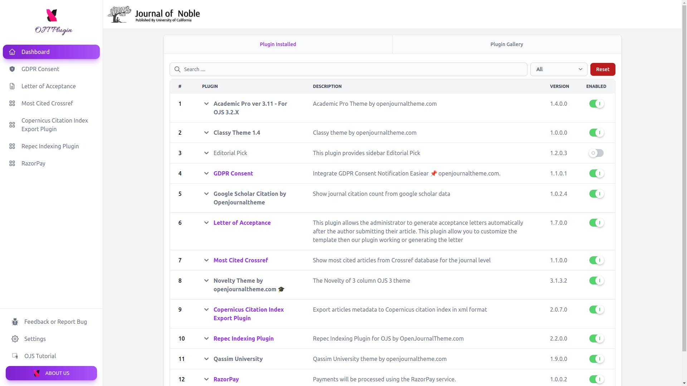

# OJT Control Panel

OJT Control Panel is a plugin wrapper for OJS that collect all Plugin created by openjournaltheme.com team.

See why we created this plugin [here](https://docs.google.com/presentation/d/1m1gS9tvI-7Sz2o4dBmyzSUmwLE2d-k6sn1DBp0sfElI)

## Features
- Dedicated control panel to manage all openjournaltheme.com plugins/themes
- Easy to install and update all plugins/themes
- Quick access to Support Center
- Quick access to OJS Tutorial resource
- Directly give feedback/report bug from Control Panel
- Protection from Plugin Error (the plugin will automatically deleted if it's causing an error)

## Installation
### From OJS
- Open Website Settings -> Plugins -> Plugin Gallery in your OJS Dashboard
- Search for "OJT Control Panel" and then Install the plugin

### Manual Upload
- Go to [releases](https://github.com/openjournalteam/ojtPlugin/releases) page.
- Download latest release tar.gz file.
- Upload the tar.gz file in your OJS 3 Plugin Manager
- If you dont know how to upload the plugin please refer to this [documentation](https://docs.pkp.sfu.ca/learning-ojs/3.3/en/settings-website#external-plugins) by PKP

## License

This plugin is licensed under the GNU GPL v3.0 License. See the [LICENSE](LICENSE) file for more information.

---
Thank you for using our plugin for your journal! If you have any questions or need assistance, please don't hesitate to contact us to support@openjournaltheme.com
