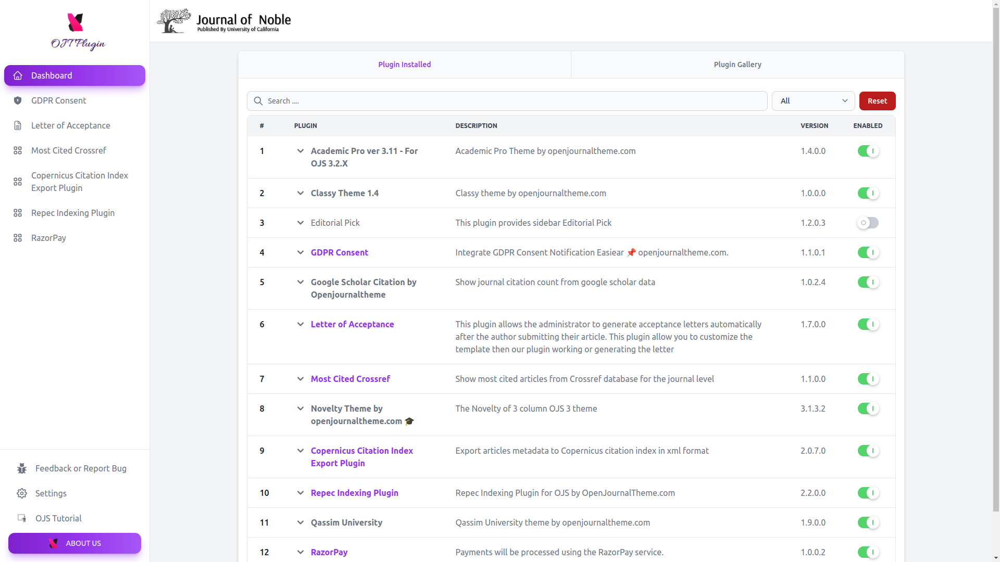

# OJT Plugin (OJT Control Panel)

`ojtPlugin` is the base ecosystem plugin for OpenJournalTheme plugins in OJS.
It provides:

1. A shared control panel page (`/index.php/{contextPath}/ojt`)
2. A modules ecosystem (`plugins/generic/ojtPlugin/modules/*`)
3. A shared background job system (`OjtJobs` + WorkerBee queue hooks)
4. Shared integration hooks for other OJT plugins



## What This Plugin Handles

- Registers OJT routes and handlers:
  - `ojt/*` -> `OjtPageHandler`
  - `ojt/api/*` -> `OjtPluginApiHandler`
- Loads and registers child plugins from `modules/`
- Adds OJT menu entry in backend for Manager/Site Admin
- Provides shared queue dispatch and processing hooks
- Provides plugin install/update plumbing for OJT marketplace flow
- Provides sitemap integration endpoint for module plugins via `getSitemapData()`

## Jobs Ecosystem (How It Works)

### 1) Register job handlers in your plugin

```php
import('plugins.generic.ojtPlugin.Jobs');
import('plugins.generic.yourPlugin.workers.YourJob');

class YourPlugin extends GenericPlugin {
    public function register($category, $path, $mainContextId = null) {
        $success = parent::register($category, $path, $mainContextId);
        if ($success && $this->getEnabled()) {
            OjtJobs::register($this, [
                new YourJob($this),
            ]);
        }
        return $success;
    }
}
```

### 2) Create a job class (recommended: extend `BaseJob`)

```php
use Openjournalteam\OjtPlugin\Jobs\BaseJob;

class YourJob extends BaseJob {
    const TYPE = 'yourPlugin.doSomething';

    public function getType() {
        return self::TYPE;
    }

    public function handle(array $payload = [], array $data = []) {
        // Your async logic here
        return true;
    }
}
```

### 3) Dispatch the job

```php
OjtJobs::dispatch(
    $this,
    'yourPlugin.doSomething',
    ['foo' => 'bar'],
    [
        'queue' => 'default',
        'delaySeconds' => 0,
        'contextId' => $this->getCurrentContextId(),
        'maxAttempts' => 3,
    ]
);
```

### 4) Run the worker

From OJS root:

```bash
php plugins/generic/ojtPlugin/tools/worker.php --queue=default
```

Useful flags:

- `--once`
- `--stop-when-empty`
- `--sleep=3`
- `--tries=3`
- `--timeout=60`
- `--memory=128`

### Queue Lifecycle Hooks Available

The queue handler calls these hooks:

- `OjtPlugin::beforeProcessJob`
- `OjtPlugin::processJob` (used by `OjtJobs`)
- `OjtPlugin::afterProcessJob`
- `OjtPlugin::jobFailed`

## Integrating Other Plugins Into OJT Control Panel

There are two common integration styles.

### A) Plugin lives inside `ojtPlugin/modules`

If your plugin is installed in `modules/`, it is auto-discovered when it has valid `version.xml` + `index.php`.

Optional methods your plugin can expose (used by module registry):

- `getPageIcon()`
- `getDocumentation()`
- `getPage()`
- `getSitemapData()`
- `getCanDelete()`
- `getCanEnable()`

### B) Site-wide plugin in `plugins/generic/*`

Hook into OJT installed plugins list:

```php
HookRegistry::register('OjtPageHandler::installed::plugins', [$this, 'embedPluginToModules']);
```

Inside callback, append plugin metadata array (pattern used by `ojtAdvanceSecurity` / `ojtBlazingCachePro`):

- `version`, `name`, `className`, `description`, `enabled`
- `isAuthorized`, `icon`, `documentation`, `page`, `sitemapData`, `canDelete`

## Frontend/Backend Hook Integration Points

Available shared hooks you can use from other plugins:

- `OjtPageHandler::index`
  - Modify control panel view data object before rendering
- `OjtPageHandler::installed::plugins`
  - Inject plugin cards into installed plugin list

Also, if your plugin exposes sitemap data:

- Implement `getSitemapData()` returning:
  - `productName`
  - `productDescription`
  - `productInstalledDate`
  - `productVersion`
  - `productUrl`
  - `productLongDescription` (non-empty to be included)

OJT will expose it under:

- `/{journalPath}/about-product/{PluginClassName}`

## Minimal Integration Checklist For New Plugin

1. Register plugin normally in OJS
2. If using queue: register jobs with `OjtJobs::register(...)`
3. If site-wide and you want to appear in OJT list: hook `OjtPageHandler::installed::plugins`
4. Optionally implement `getDocumentation()`, `getPageIcon()`, `getPage()`, `getSitemapData()`
5. Start queue worker for async jobs
